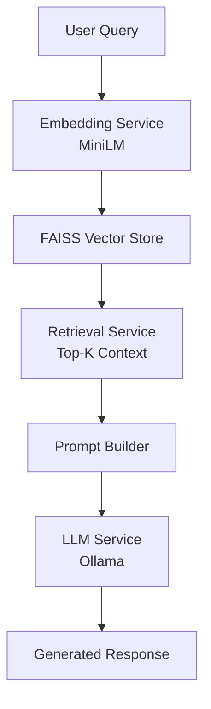

<div align="center">

# 🚀 CuratorAI

**A Full-Stack Retrieval Augmented Generation (RAG) System**

CuratorAI is an intelligent retrieval system that combines semantic search with LLM-powered response generation. It transforms user queries into embeddings using `all-MiniLM-L6-v2`, retrieves relevant context via FAISS, and generates responses through Ollama (Dockerized LLM inference).

[](LICENSE)
[](https://www.python.org/)
[](https://angular.io/)
[](https://www.django-rest-framework.org/)

</div>

---

## 🧠 System Architecture



---

## ⚙️ Tech Stack

| Layer | Technology |
|-------|-----------|
| **Frontend** | Angular v18, PrimeNG v17 |
| **Backend** | Django REST Framework, Celery, SQLite |
| **Embeddings** | `all-MiniLM-L6-v2` |
| **Vector Store** | FAISS |
| **LLM Inference** | Ollama (Docker) |

---

## 📁 Project Structure

```bash
CuratorAI/
├── Backend/
│   ├── celery/
│   │   └── worker.py
│   ├── config/
│   │   ├── chat/
│   │   ├── config/
│   │   ├── db.sqlite3
│   │   ├── documents/
│   │   ├── embeddings/
│   │   ├── faiss.index
│   │   ├── manage.py
│   │   ├── retrieval/
│   │   └── users/
│   ├── services/
│   │   ├── chunking_service.py
│   │   ├── document_parser_service.py
│   │   ├── embedding_service.py
│   │   ├── index_sync_service.py
│   │   ├── llm_service.py
│   │   ├── retrieval_service.py
│   │   └── vector_store_service.py
│   ├── media/
│   │   └── uploaded_documents/
│   ├── docker-compose.yml
│   └── requirements.txt
└── Frontend/
    ├── src/
    ├── public/
    ├── angular.json
    ├── package.json
    ├── tsconfig.app.json
    ├── tsconfig.json
    └── tsconfig.spec.json
```

---

## 🚀 Getting Started

### 1️⃣ Clone the Repository

```bash
git clone https://github.com/shubhamsapkal2912/CuratorAI.git
cd CuratorAI
```

### 2️⃣ Backend Setup

```bash
cd Backend

# Create and activate virtual environment
python -m venv venv
source venv/bin/activate        # Mac/Linux
venv\Scripts\activate           # Windows

# Install dependencies
pip install -r requirements.txt

# Run migrations and start server
cd config
python manage.py migrate
python manage.py runserver
```

### 3️⃣ Run Celery Worker

```bash
cd Backend
celery -A celery.worker worker --loglevel=info
```

### 4️⃣ Start Ollama via Docker

```bash
cd Backend
docker-compose up -d
```

Then pull and run a model inside the container:

```bash
docker exec -it <container_id> ollama run llama3
```

### 5️⃣ Frontend Setup

```bash
cd Frontend
npm install
ng serve
```

---

## 🔄 Core Services

| Service | Responsibility |
|--------|---------------|
| `chunking_service.py` | Splits documents into semantic chunks |
| `embedding_service.py` | Converts text chunks into vector embeddings |
| `vector_store_service.py` | Stores and manages embeddings in FAISS |
| `retrieval_service.py` | Finds top-K relevant context for a query |
| `llm_service.py` | Calls Ollama to generate responses |
| `index_sync_service.py` | Keeps the FAISS index synchronized |

---

## 📡 API Flow

Upload documents

Chunk → Embed → Store vectors in FAISS

User sends a query

Retrieve top-K similar chunks

Pass context + query to LLM

Return generated response

---

## ✨ Features

- 🔍 **Semantic Search** with FAISS vector indexing
- 🧠 **RAG-based** response generation
- ⚡ **Fast local inference** using Ollama
- 🔄 **Async processing** with Celery
- 📂 **Document ingestion & indexing** pipeline
- 🧩 **Modular service-based** backend architecture

---

## 🔐 Advantages

- **Privacy-first** — runs entirely locally, no data sent to external APIs
- **Scalable** — clean service-based design makes it easy to extend
- **Efficient retrieval** — FAISS enables fast approximate nearest-neighbor search
- **Extendable** — plug in new models or swap the database with minimal changes

---

## 🛠️ Roadmap

- [ ] Streaming LLM responses
- [ ] Migrate to PostgreSQL
- [ ] JWT-based authentication
- [ ] Document management UI
- [ ] Multi-tenant architecture
- [ ] Cloud deployment (AWS / GCP)

---

## 🤝 Contributing

Contributions are welcome! Feel free to fork the repo and submit a pull request.

---

## 👨‍💻 Author

**Shubham Sapkal**
Full Stack Developer | AI Engineer

---

## 📄 License

This project is licensed under the [MIT License](LICENSE).
